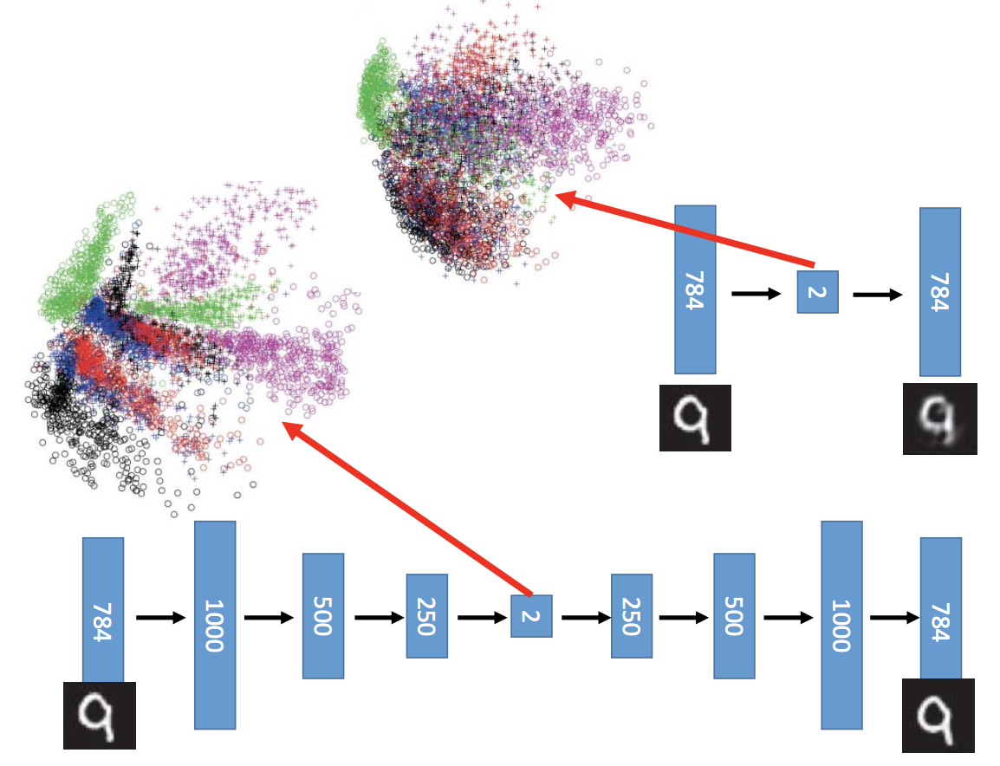

# Deep Auto-encoder

最后一个Sequential Model：transformer 需要的背景知识

## Encoder & Decorder

> 无监督学习

第一部分为编码器。原来784维精简后的特征。

第二部分为解码器。

同时训练编码器与解码器。

 

## PCA 介绍

$c$表示$code$，即精简后的特征。如果把它当作Layer来看的话，是一个非常窄的Layer。所以称之为Bottleneck Layer。

前面部分在做encode，后面部分在做decode。我们希望$(x-\hat x)^2$越小越好。

 

## Deep Auto-encoder 介绍

####与PCA的不同

1. 上面的PCA只有一层Hidden Layer，我们可以增加到多层Hidden Layers。
2. PCA中前后$W$互为转置。而在Deep Auto-encoder中，可以令对应$W$互为转置（好处是参数少一半），也可以不控制（常见做法）。这也就是说，对称不是必须的。

 

####Deep Auto-encoder举例

- PCA：结果比较模糊
- Deep Auto-encoder：结果非常清晰。

 

如果是降到二维，我们可以看到：

- PCA：

   所有数字混在一起

- Deep Auto-Encode：

  数字是分开的

 

##Deep Auto-encoder  Denoise 去噪

注意，这里的损失函数是：$min(x-\hat x)^2$

即希望，原图与结果越接近越好。

 

## Deep Auto-encoder - Text Retrieval 文字检索

###1. Vector Space Model

把每一篇文章都表示成空间中的每一个点。一个Query也表示成一个点。

离这个Query最近的，就是要的Document。

 

#### 缺点：

没有考虑语义相关的东西。

###2. Auto-Encoder

> 是一种无监督学习。

- Input：一段文字

- Encode Result：得到一个二维结果。

- 最终结果如右上所示：每个点表示一个document，同一个颜色即一类。比如，某一类都是Energy markets。

  搜索Query时（也是压缩到二维），只在某一类中搜索，由此可以提高精度和效率。

> 用LSA效果就不好

 

##Deep Auto-encoder - Similar Image Search 相似图片搜索

### 1. 计算图像相似程度

如果使用欧几里得距离来计算像素相似性，效果很差。

### 2. Auto - Encoder

输入图像做Auto-Encoder，输出code做搜索。即在code上计算相似度。

 

使用Auto - Encoder，在code上计算相似度的结果：

 

##其他

###1. 训练结束后，可以丢掉Decoder

我们更关心code，因此可以丢掉decoder，我们不关心他是否能restructure。

 

###2. 也可以进行有监督学习 

利用分类，来计算损失函数。

 

