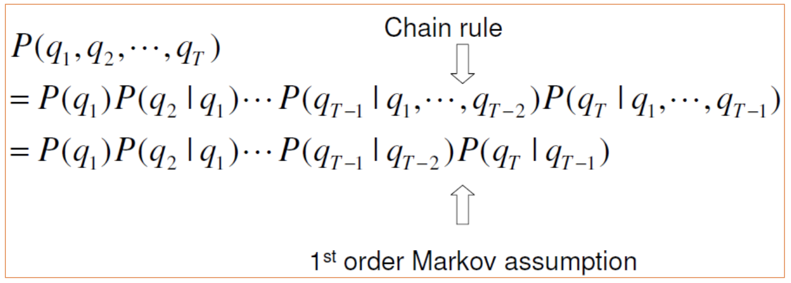
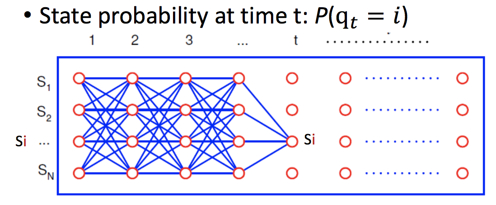
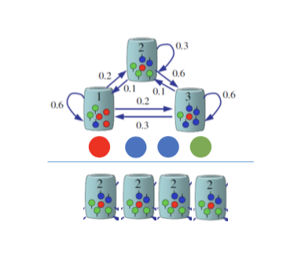

# Sequence Learning: HMM

## 介绍

### 1. Sequential Data 序列数据

基于时间序列的数据，包含顺序信息。

举例：手写字迹、DNA

性质：can't reverse 不能改变顺序

###2. Advantage of HMM on Sequential Data 

使用HMM处理时间序列的优势：

- 快，高效
- 有三个高效的算法：evaluation，decoding，training

### 3. HMM的应用

- 线上手写识别
- 演讲翻译、识别
- 视频分析、追踪
- 基因序列
- 股票价格预测

## Markov Model

### 1. 使用场景 Scenario

根据前一天的天气情况，预测下一天的天气。

 

> 注意：输出边的权重之和是1。

### 2. 定义

####基本定义

- 观测状态：${s_1,s_2,s_3}$

> 在这里即：雨雪，多云，晴天

- 观测序列：$q_1,q_2,…,q_T$

> 某一时间点$t$的状态

####性质说明

- 马尔可夫假设：当前时间点的状态，仅与上一个时间点的状态有关。

 

- 当前时间点的状态，与时间点没有关系。

> $t$ 可为任意值。

 

####状态转移矩阵

- 状态转移矩阵

 

其中，$a_{ij}$表示：上一个时间点状态为$s_i$，下一个时间点状态为$s_j$的概率。即，$a_{ij} = P(q_t=s_j|q_{t-1}=s_i)$

- 初始的状态概率

 

###3. 使用Markov Model，解决Sequence Problem

#### 解决的问题

出现某一时间序列的概率 $P(q_1,q_2,…,q_T)$

> 已知时间序列上的各个状态，以及状态转移矩阵。求解出现这种时间序列的概率。

#### 利用Markov Model求解

 

#### 举例

#####问题

 

已知$P(q_1,q_2,…,q_8) = P(s_3, s_3, s_3,s_1,s_1,s_3,s_2,s_3)$，且$P(q_1=s_3) = 1$

求该概率值。

#####求解

$$
\begin{align}
=& P(s_3)*P(s_3|s_3)*P(s_3|s_3)*P(s_1|s_3)*P(s_1|s_1)*P(s_3|s_1)*P(s_2|s_3)*P(s_3|s_2) \\
=& \pi_3 * a_{33}*a_{33}*a_{31}*a_{11}*a_{13}*a_{32}*a_{23}
\end{align}
$$

### 4. 使用Markov Model，解决State Probability

#### 解决的问题

求解某一时间点的状态为$s_i$的概率 $P(q_t=s_i)$

 

#### 方法一：耗时

遍历所有路线，求和。

时间复杂度为$O(N^t)$

#### 方法二：每个节点记录了自己的概率

> 例如，第一列节点分别记录$P(q_1=s_1),P(q_1=s_2)...P(q_1=s_N)$
>
> 第二列节点，可以根据第一列节点值进行计算。
>
> $P(q_2=s_1)=P(q_1=s_1)*a_{11}+P(q_1=s_2)*a_{21}…+P(q_N=s_1)*a_{N1}$
>
> 即，$P(q_2=s_1)=\sum_{j=1}^N P(q_1=s_j)*a_{j1}$
>
> 以此类推。

则某一时间点的状态为$s_i$的概率，就是前一个节点出现的概率乘上状态转移值，遍历求和。

$P(q_t=s_i)=\sum_{j=1}^N P(q_{t-1}=s_j)*a_{ji}$

 

时间复杂度为$O(t*N^2)$

## Hidden Markov Model （HMM）隐式马尔可夫

> 上一个问题，我们讨论的是在不同时间节点时不同状态的概率。
>
> 现在，我们在同一状态下，还会产生不同的符号。即在确定当前时间节点的状态后，还会有不同的概率产生不同的符号。

### 1. 举例

 

图中有三个桶，表示三个状态。上图已有状态转移矩阵。

> 根据，之前的学习内容，我们可以计算得到：1. 某个序列的概率 2. 某个时间点是某一状态的概率，即$P(q_t=s_i)$。

如今，每一个桶分别有不同个数不同颜色的球。

用$N$表示状态种类数（桶的种类数），用$M$表示符号种类数（球的种类数）

### 2. 生成过程

####步骤

1. 随机选一个初始的桶（初始状态的概率）
2. 随机选出这个桶中的一个颜色的球（不同颜色的球在这个桶中的概率）
3. 随机选下一个桶（状态转移矩阵）
4. 重复第2步、第3步。

 

####结果

**最终，我们会得到两个序列。**

一个是状态序列。（即桶的序列）【这是我们已经会求的概率】

一个是符号序列。（即球的颜色序列）【在确定状态序列后，我们也可以求得该概率】

 

### 3. HMM的定义

#### 对Hidden的理解

我们只看到符号序列，而不知道状态序列。

在上一个例子中，也就是我们只看到最终球的颜色序列，而不知道桶的选择序列。

 

#### 定义

 

> $N$：桶的个数，即状态数。$s_1,s_2...$
>
> $M$：球颜色的个数，即符号数。$v_1,v_2...$
>
> $A$：状态转移矩阵。$a_{ij}$表示$i$桶后取$j$桶的概率。
>
> $B$：符号在不同状态下的分布。$b_i{(v_k)}$表示第$i$个桶取第$k$个颜色的概率。
>
> $\pi$：初始状态分布。

#### 性质说明

 

在已经确定状态序列时，当前时间节点取出符号的概率，只与状态有关。

也就是说，若确定了$q_t$，则$P(X_t|q_t)$只与$q_t$有关。比如，$q_t$是第$3$个桶，则$t$时刻红球的概率是$1/6$。

#### 举例

 

## Three Algorithms of HMM

### 1. 三种问题概述

> 说明：下图中的$\lambda$指的是模型。

#### 问题1: 产生某一个观察序列的概率

> 比如，得到$P(红球，蓝球，蓝球，绿球，红球)$的概率是多少？

 

#### 问题2: 根据已得到的观察序列，计算最有可能的状态序列

> 比如，已知最终得到了红球、蓝球、蓝球、绿球，计算可能的桶的序列

 

#### 问题3: 如何估计或者优化HMM参数

> 比如，已知最终得到了红球、蓝球、蓝球、绿球，但不知道状态转移矩阵、符号分布矩阵和初始值，如何去估计。

 

### 2. 问题1 —— Model Evaluation 模型评估

#### 描述问题

 

- 问题定义：给定模型$\lambda$，给定观察序列$X=x_1,x_2,…,x_T$，计算该观察序列的概率$P(X|\lambda)$。
- 问题举例：给定观察序列是**红球，蓝球，蓝球，绿球，红球**，求这种情况的概率。

#### 解决方法一：耗时

遍历每一个状态线路，求这条线路上产生该观察序列的概率，求和。

时间复杂度$O(N^T)$

#### 解决方法二：Forward Algotithm

#####1. 每个节点的保存

每个节点保存的值表示：当前时间点$t$的状态是$s_j$，且观察结果是$x_t$的概率$\alpha_t(j)$。其中观察结果是已经确定的值。

$\alpha_t(j)=\sum_{i=1}^N\alpha_{t-1}(i)*a_{ij}*b_j(x_t)$

> $\alpha_{t-1}(i)$：上一个时间点，由$i$桶产生$x_{t-1}$的概率。
>
> $a_{ij}$：$i$桶到$j$桶的概率。
>
> $b_j(x_t)$：$j$桶产生$x_t$的概率。

比如，第二个时间点是第$3$个桶产生蓝球的概率；第二个时间点是第$4$个桶产生蓝球的概率（说明：第二个时间点一定是产生蓝球）。

 

##### 2. 完整算法

 

初始值：每个桶的初始概率乘上能产生$x_1$结果的概率。

每个节点的计算

最终值：$t$时刻，各节点求和。

##### 3. 计算举例

####解决方法三：Backward Algotithm 

##### 1. 每个节点的保存

> 第三列的含义：
>
> 当前时间点是$3$，状态为桶$1$。此时，时间点是$4$得到蓝球的概率$p_1$。
>
> 当前时间点是$3$，状态为桶$2$。此时，时间点是$4$得到蓝球的概率$p_2$。
>
> 当前时间点是$3$，状态为桶$3$。此时，时间点是$4$得到蓝球的概率$p_3$。
>
> 第二列求值：
>
> - 当前时间点是$2$，状态为桶$1$。此时，时间点是$3, 4$得到绿球、蓝球的概率：
>
>   $a_{11}*b_1{绿球}*p_1+a_{12}*b_2{绿球}*p_2+a_{13}*b_3{绿球}*p_3$

每个节点保存的值表示：当前时间点$t$的状态是$s_i$，从$t+1$到$T$的观察结果是$x_{t+1},...x_{T}$的概率$\beta_t(i)$。其中观察结果是已经确定的值。

$\beta_t(i)=\sum_{i=1}^N\alpha_{t-1}(i)*a_{ij}*b_j(x_t)$

##### 2. 完整算法

 

###3. 问题2 —— Most Probable Path 寻找最可能的时间序列

> Viterbi Algorithm

#### 说明

 

已知状态转移概率、观察符号的概率，以及最终的观察序列。求最可能的状态序列

#### 描述问题

 

- 问题定义：给定模型$\lambda$，给定观察序列$X=x_1,x_2,…,x_T$，计算最有可能的状态序列。$Q^*=\text{arg max}_QP(X,Q|\lambda)=\text{arg max}_QP(X|Q,\lambda)*P(Q|\lambda)$

#### 问题解决：Viterbi Algorithm

> 动态规划

##### 1. 节点保存

保存时间$t$时，到达每个状态$i$的最可能路径的概率和前一个节点。

每个节点都会计算：

 

- Path Probability

  - 含义：

    $\delta_{t}(i)$，时间$t$时到达状态$i$的最可能路径的概率。（满足前$t$个状态序列）

  - 计算

    

    > 遍历前面的节点，分别计算，保存最大值。
    >
    > 注意：$b_j(x_{t+1})$对于不同的$i$，值是一样的。

- Path node

  - 含义：

    $\psi_t(i)$，时间$t$时到达状态$i$的最可能路径的前一个节点。

    > 遍历前面的节点，记录得到最大$\delta_{t}(i)$的前一个节点。

  - 计算：

    

    > 即，找到使得$\delta_{t+1}(j)$最大的$i$值。
    >
    > 由于$b_j(x_{t+1})$对于不同的$i$，值是一样的。因此这里可以去掉。

##### 2. 整体算法

 

**关于Termination说明：**

最终在时间$T$时，遍历所有节点，找到最大的$\delta_T(i)$作为最终的概率$P^*$。取得最终$P^*$的节点，记为$q_T^*$，是最可能路径的最后一个节点。

**关于Path backtracking说明：**

由于每个节点都记录了前一个节点。因此可以找到路径。

##### 3. 计算举例

 

## Pattern classification by HMM

 ## Applications of HMM

