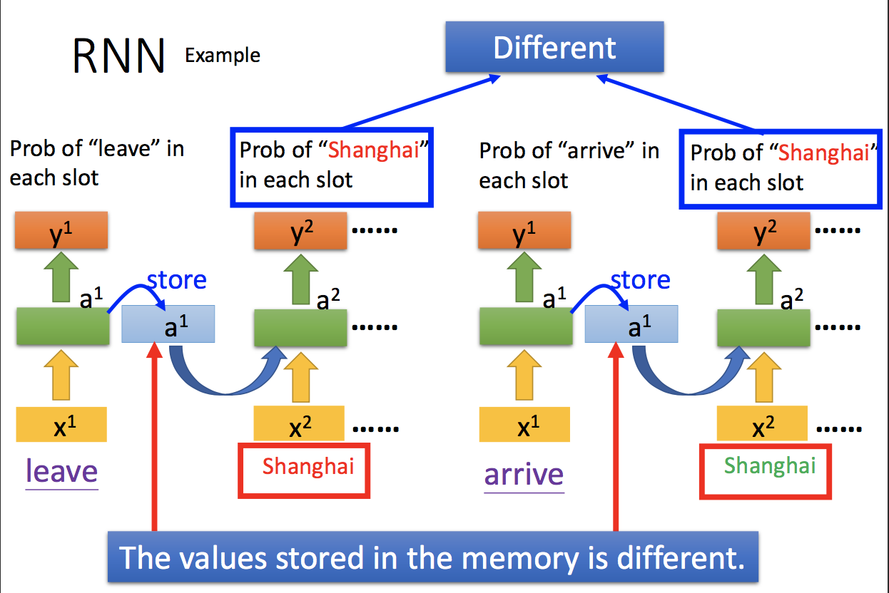

# Recurrent Neural Network（RNN）

> 循环神经网络

## 一、Language Modeling 语言模型

目标：估计一个字段的概率（word sequence） $P(w_1,…,w_m)$

举例：

- Input：语音，需要判断该语音是字段1还是字段2。
- Output：字段1，当$P(字段1)>P(字段2)$

### 1. N-gram Language Model

#### 原理

1. 根据前$n-1$个字决定概率。

2. 根据训练集计算概率。

   

   - 问题所在：有些句子不存在训练集中。

   - 改进措施：

     尽管训练集中没有*dog jumped*，使用$0.0001$取代0。

      

   - 这种改进依旧存在问题：

     - 概率精度低。
     - 我们无法收集世界上所有可能的文本作为训练数据。

### 2. Feed-Forward Neural Language Model

#### （1）主要思想

计算概率 $P(w_1,…,w_m)$，不使用count，而是使用Neural Network Prediction。

#### （2）举例

 

分别使用神经网络估计后面这四个的概率。

#### （3）网络结构

 

- 第一层

  - 输入：一个单词的字符向量$x$

    > 例如，*wreck*对应的向量

  - 输出：$\sigma (W^{(1)}x+b^1)$

- 第二层

  - 输入：$\sigma (W^{(1)}x+b^1)$ 与 $x$

  - 输出：$softmax(W^{(2)}\sigma (W^{(1)}x+b^1) + W^{(3)}x+b^3 )$

    > $\sigma (W^{(1)}x+b^1)$与权重$W^{(2)}$
    >
    > $x$与权重$W^{(3)}$

#### （4）优势分析

假如相关单词的输入层（或隐藏层）结果很接近，那么如果训练集中没有某个单词，但有相近的其他单词，该单词的概率依旧会变高。这意味着神经网络自动完成了平滑（smoothing）

例如，训练集中*dog jump*比较多，最终$P(jump|dog)$比较高，这会导致$P(jump|cat)$也较高。因为$dog$与$cat$的输入特征（或隐藏层特征）相似。

#### （5）缺点分析

用于条件作用的固定上下文窗口。对于输入size，需要hard code。

#### （6）应用举例

有一个Slot Filling系统

- 输入：一句话
- 输出：筛选出这句话中，哪个字段属于哪个Slot。

 

#####使用Feed-Forward Neural Network 解决该问题：

- 搭建Feed-Forward Neural Network
- 输入：一个用向量表示的词汇。例如 *Shanghai* 用向量表示后的结果。
- 输出：这个词汇属于每个slot的概率。

##### 局限性

只输入 *Shanghai* ，无法知道它是目的地还是出发地。

因此我们需要神经网络具有记忆力，能记住之前的 *arrive*,  *leave*。即，后面的RNN。

这样就能解决，同样的Input，得到不同的Output。

 

#### （7）扩展：词汇的向量表示

##### 1-of-N encoding

已经规定好一个向量：[apple, banana, cat, dog]

则 *cat* = [0, 0, 1, 0]

#####Beyond 1-of-N encoding

已经规定好一个向量：[apple, banana, cat, dog, other]

则  *other* = [0, 0, 0, 0, 1]

#####Word hashing (也是一种Beyond 1-of-N encoding)

例如，分别给连续三个的字母编码，共有$26*26*26$个码。

 

### 3. Recurrent Neural Network Language Model (RNNLM)

想法：神经网络能考虑到该Input之前所有的单词，并在每个时间步上添加权重。

假设：时间信息很重要

实现：前一个hidden layer的输出会被保存下来，传输到后面。即有两组输入。

 

## 二、Recurrent Neural Network

### 1. 举例说明

隐藏层的输出，会被存在Memory中。

绿色隐藏层的输入，不仅有黄色的Input，还有蓝色中存储的上一次隐藏层输出。

> 所以，RNN会考虑Input Sequence。不同顺序的Input，其Output不一样。

 

解决上面提到的Slot Filling系统问题。输入同一个词汇，不同输出的问题得以解决。

由于*Shanghai*前面的词汇分别是 *leave*和*arrive*，所以它们预测属于每个slot的概率不同。

 

 

上述例子中，计算公式：

 

### 2. 定义

 

### 3. 训练

- 需要更新的参数 $\theta = (U,V,W)$

- 损失函数

  计算$y_{t+1}$与$o_{t+1}$的差值，计算总和得$C(\theta^i)$

   

- 梯度下降

  使用梯度下降，更新所有的参数

   

### 4. 训练方法 BPTT （Backpropagation through Time）

 

本质还是链式求导法则。

举例：

$C^4$对绿色Weight求导，更新其参数。对黄色Weight求导，更新其参数。对蓝色Weight求导，更新其参数。

继续，对前一个蓝色Weight求导，此时该蓝色Weight的更新，还要加上$C^3$部分对它的求导。

继续，对前一个黄色Weight求导，此时该黄色Weight的更新，还要加上$C^3$部分对它的求导。

> 从这里开始，需要重新深入理一遍。
>
> **TODO:** PPT 66-70 看不懂

###5. 训练问题 

> 后向传播和梯度问题：
>
> <https://blog.csdn.net/jizhidexiaoming/article/details/81743584>

#### 问题说明

Error Surface 有的地方很平坦，有的地方很陡峭。导致梯度消失或梯度爆炸。  

 

于是，会导致梯度消失（Gradient Vanishing）或者梯度爆炸（Gradient Exploding）

 

#### 问题原因

> High Sequence

某一个因子每次计算都会被乘。

当这个值在$[0,1]$之间，随着时间增多，就会趋近于零。

当这个值大于$1$，随着时间增多，就会趋近于无穷。

 

#### 解决方式

#####针对梯度爆炸问题： Clipping 修剪

当Gradiant超过某个阈值后，就设置成阈值的值。

 

##### 针对梯度消失问题： Initializaton + ReLU

**方法一：**

- 初始化

  所有的$W$，初始化为单位矩阵

- ReLU

  RNN梯度消失是因为激活函数tanh函数的倒数在0到1之间，反向传播时更新前面时刻的参数时，当参数W初始化为小于1的数，则多个(tanh函数’ * W)相乘，将导致求得的偏导极小（小于1的数连乘），从而导致梯度消失。

  因此使用ReLU可以避免这个问题。

使用这两个方法后的损失函数（IRNN）

 

**方法二：Gating Mechanism （LSTM）**

解决长期依赖的问题（long-term dependencies）

## 三、Applications

