# Reinforcement Learning

## 一、定义

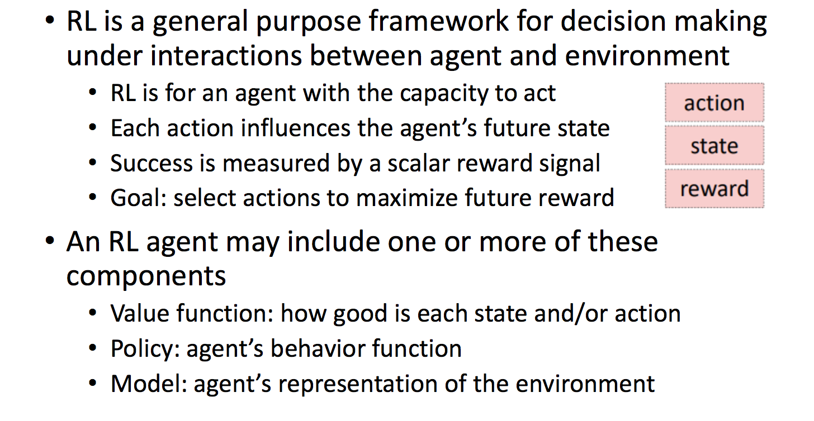

目的：RL是用来做决定的

注意：每个Action都影响着Agent的未来State

目标：Reward最大化

#### 对比：机器学习与强化学习

监督学习：Learning From Teacher／Evaluation，只需要关注input和output。

强化学习：Learninng From Experience。不断进行Agent与Environment的交互。

> AI是一个agent，可以完成人类的任务
>
> AI = RL+DL RL表示objective，DL给定mechinism

## 二、介绍

> <https://www.bilibili.com/video/BV1kt411D76e?from=search&seid=1129997296422386478>

###（1）主要元素

Agent and Environment

Action, State and Reward

> Agent 智能体（学习器）；Environment 环境。
>
> State 状态；Reward 奖励；Action 动作。

###（2）整体流程

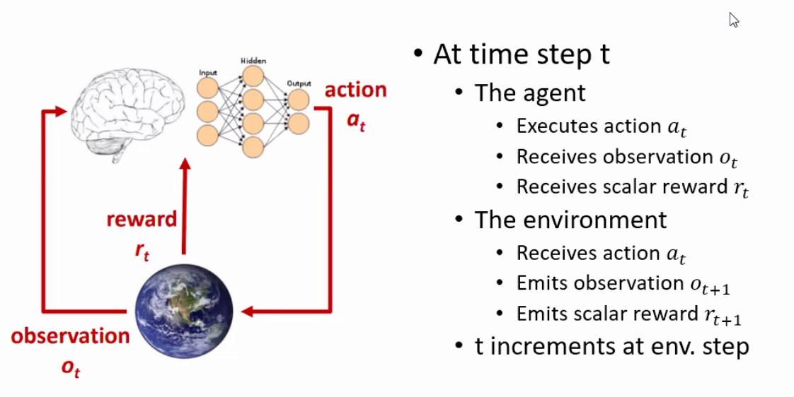

 在$t$时刻

- Agent

  输入：从环境中观察到的现象$o_t$

  输入：现象$o_t$的奖励$r_t$

  输出：计算得到动作$a_t$ （Action的计算是根据**Experience**的）

- Environment

  输入：动作$a_t$

  准备发射新的现象$o_{t+1}$，和对应奖励$r_{t+1}$

- $t = t+1$

> Agent 是观察者，输入是**观察到的现象**和**对应的奖励**，输出是**动作**。
>
> Environment是环境，输入是**动作**，输出是**新的现象**和**新的奖励**

### （3）State介绍

####1. Experience

Experience 是一个序列：observations, rewards, actions

$o_1, r_1,a_1…,o_t, r_t$

对于Agent而言，它会根据Experience，计算得到Action。

对于Environment而言，它会根据Experience，计算得到Observation和Reward。

> 但是Experience 太长了，最好能从中提取有效信息。

####2. State

State 是对Experience的总结，决定了下一步发生什么。

State实质是一个函数，参数是Experience：

$s_t=f(o_1,r_1,a_1...a_{t-1},o_t, r_t)$

每经历一个时间步长$t$，我们就构建一个State

####3. Environment State  

对于Environment而言，它会根据Environment State，计算得到Observation和Reward。

另外，Agent对于Environment State，可以是不可见的。Agent只知道Observation和Reward。

> Environment State 对于我们Agent 算法的构建没有什么用处。

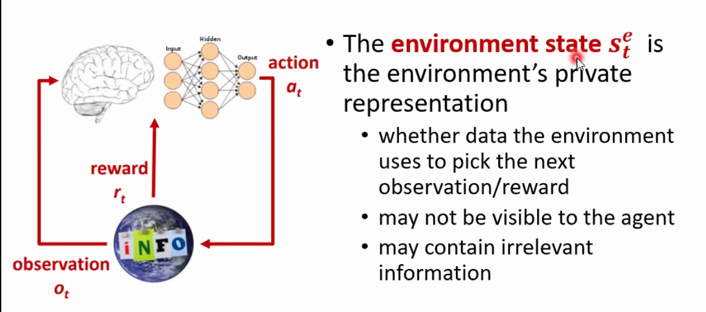 

#### 4. Agent State

对于Agent而言，它会根据Agent State，计算得到Action。

> 如何根据Experience构建Agent State，如何得到Action，这是我们要做的事情。

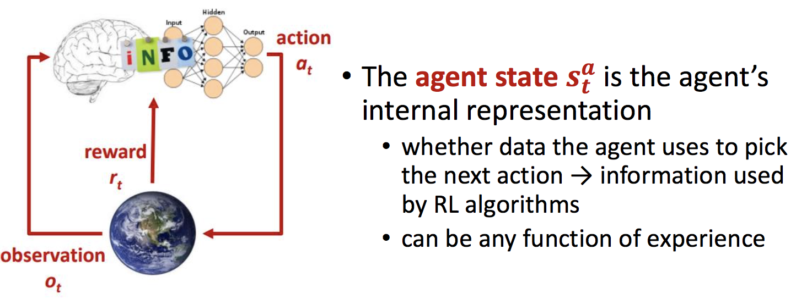

####5. Information State 信息状态

包含来自历史记录的所有有用的信息，也称之为Markov State。

#####Markov性质：

下一时刻的状态，仅有当前时刻决定。

$P(s_{t+1}|s_t)=P(s_{t+1}|s_1,…,s_t)$

##### 如果当前状态具有Markov性质：

一旦state确定后，experience可以丢弃。

####6. Fully Observable Environment 完全可观察的环境 

> 后面的学习基本基于这个假设。

- Agent可以直接观察到的Environment State

  此时，$o_t = s_t^a=s_t^e$

- 此时 Information state = Agent state = Environment state  

这是Markov decition process（MDP）

#### 7. Partially Observable Environments 部分可观察的环境

> 生活中的常见形式
>
> 例如：机器人通过摄像头获得Observation（只知道房间内部的信息），它并不能知道Environment State（具体所处位置等）

- Agent不可以直接观察到的Environment State

  此时，$s_t^a \ne s_t^e$

- Agent必须创建自己的Agent Sate

这是partially observable Markov decision process (POMDP)

##### 我们的工作：构建Agent State

- 方法一：直接记住Experience

  $s_t^a=H_t$

- 方法二：使用环境状态的Belief来计算（贝叶斯方法）

  $s_t^a={P(S_t^e=s^1),…,P(S_t^e=s^n)}$

- 方法三：RNN

  $s_t^a=\sigma (W_s*s^a_{t-1}+W_o*o_t)$

  > 将上一个状态和当前观察联系起来，得到当前状态。

### （4）Agent介绍

> Agent并非必须包含这三个部分，只是常用这三个函数。

####1. 主要由三部分组成：

- Policy：策略函数。输入Agent State，输出Action。

  > $a = \pi(s)$

- Value Function：评价当前Agent State或Action的好坏，采取某一系列Action得到的预估奖励是多少。

  > 使用情景：如果当前有多种Agent State，对应生成了多种Action。用来估计哪个Action，得到的奖励多

- Model：Agent用来估计Environment变化的。

  > 包括两个部分：
  >
  > 1. Transition Model
  >
  >    预测下一个Environment State
  >
  > 2. Reward Model
  >
  >    预测下一个Reward
  >
  > 另外，Model不是必须的。

#### 2. 举例

- Policy

  输入当前位置（state），输出方向（action）

  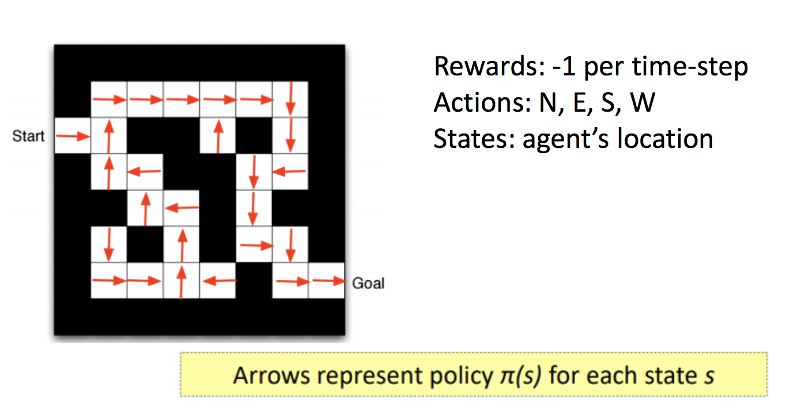

- Value Function

  每个State的预估奖励

  > 快到终点时是$-1$。说明预估奖励比较大。

  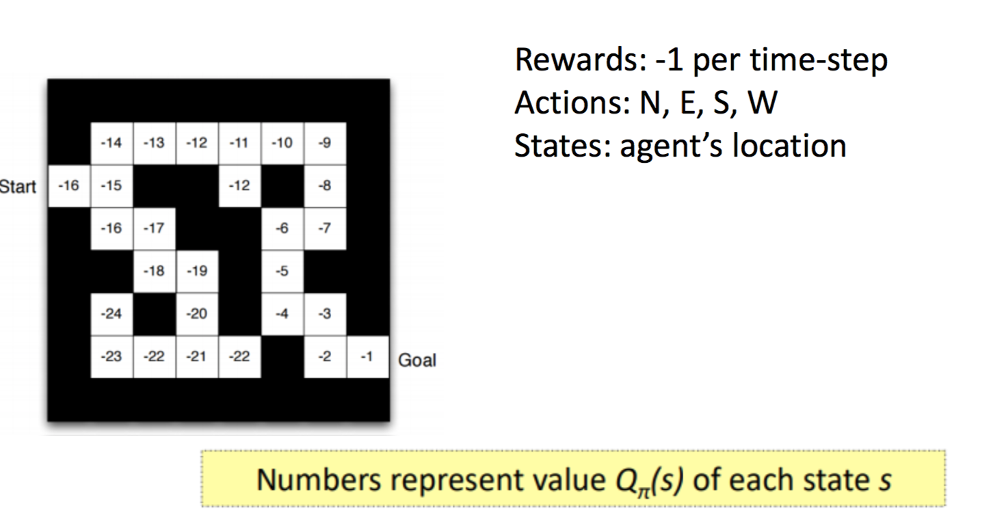

- Model

  模拟环境状态和环境给的奖励。

  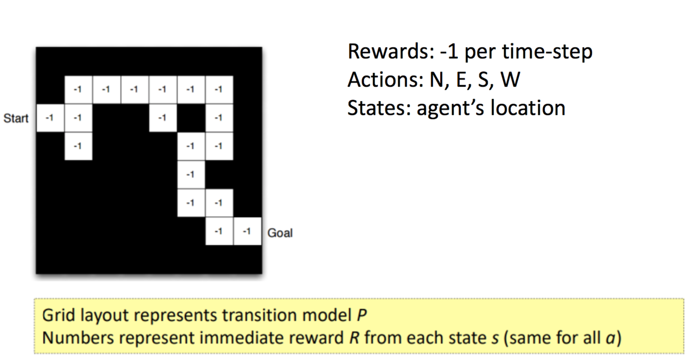

#### 3. Agent分类（五种增强学习的方式） 

- Value-Based

  包含Value Function，不包含Policy。

  Agent通过Value Function选择最优的措施。

- Policy-Based

  包含Policy，不包含Value Function

- Actor-Critic

  结合Policy与Value Function

- Model-Free

  包含Policy and/or Value Function

  不包含Model

- Model-Based

  包含Policy and/or Value Function

  包含Model

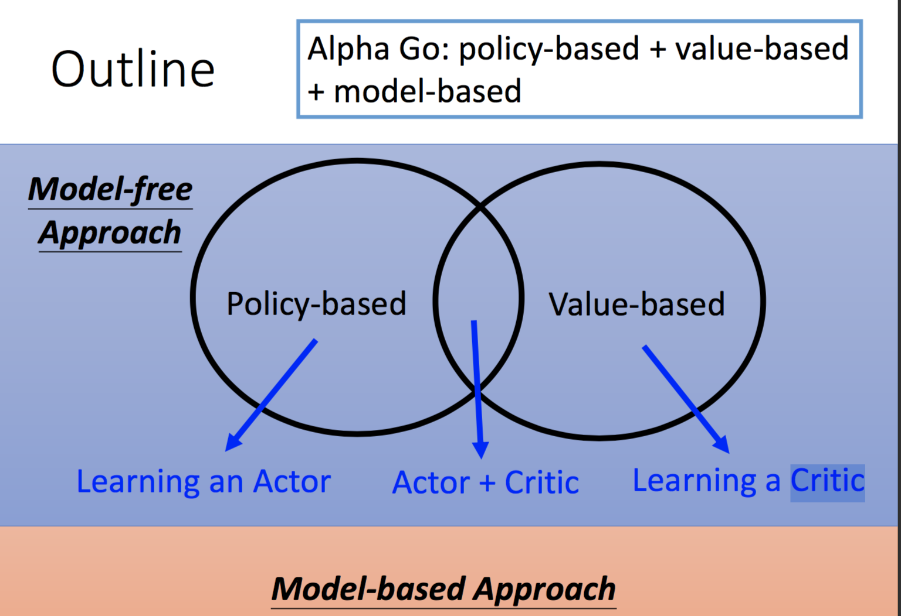

> Critic: 评论家

### （5）Reward介绍

强化学习基于奖励假设。

通过最大化累积奖励，来训练Agent。

### （6）总结

这是一个连续决策问题（Sequential Decision Making）

**目标：最大化未来奖励**

**强调几点：**

1. 我们需要考虑未来，再做出Action

2. Reward可能会延迟（可能未来会出现）

   > 例如，金融投资、下棋。

3. 上一点就意味着当下可能会放弃一些奖励，为了未来更多的奖励。

## 三、Process 过程

### （1）Markov Process

马尔可夫过程（Markov Process）是一个无记忆随机过程（memoryless random process）：$s_1,s_2,…,s_t$

$S$：state / observation的有限集合

$P$：状态转移概率

> 即有一个随机状态序列，符合Markov性质，那它就是Markov Process
>
> Markov性质：$P(s_{t+1}|s_t)=P(s_{t+1}|s_1,…,s_t)$

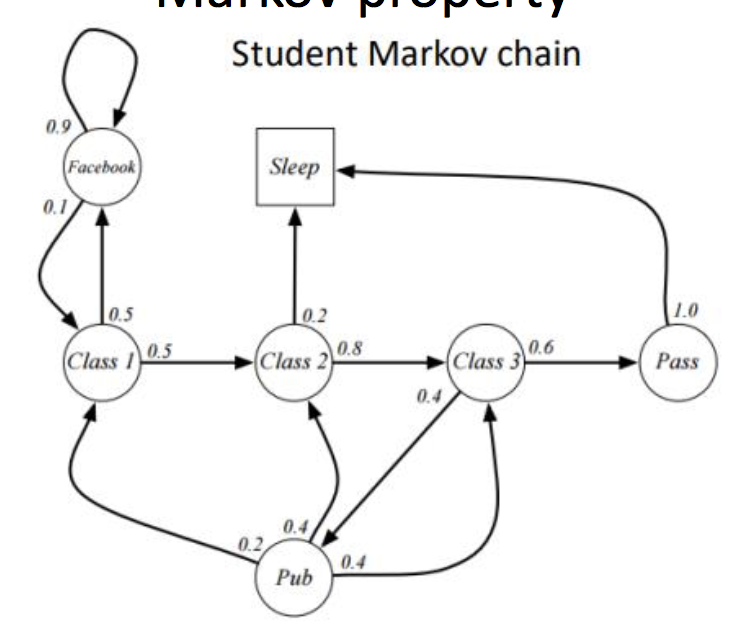

### （2）Markov Rewad Process (MRP)

Markov reward process is a Markov chain with values

#### 理解：

带有Value判断的Markov Process。这些Value会告诉我们这些状态有多好，可以帮助我们计算出这个序列带有多少Reward。

####包含内容：

$S$：state / observation的有限集合

$P$：状态转移概率

$R$：即时奖励

$\gamma$：discount factor

####举例：

下图中，$R$表示当前状态会得到的Reward，$G_t$表示累积Reward，$r_t$表示当前时间步得到的Reward。

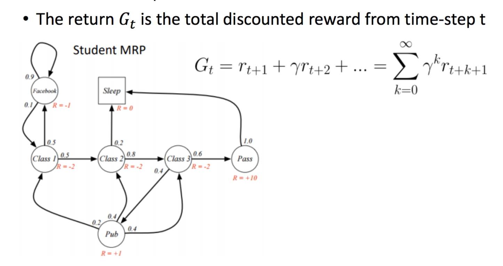

###（3）Markov Decision Process (MDP)

Markov decision process is a MRP with decisions

####理解：

带有决策的MRP。（有Reward，有Action）

#### 包含内容：

$S$：states / observations的有限集合

$A$：actions的有限集合

$P$：状态转移概率

$R$：即时奖励

$\gamma$：discount factor

#### 目标：

选择出Policy $\pi$，使得预期的总回报最大化：

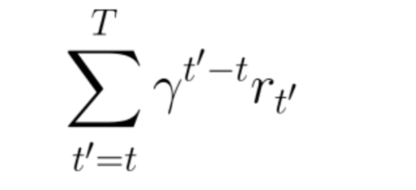

#### 举例：

区别：都是选择，没有概率之分。

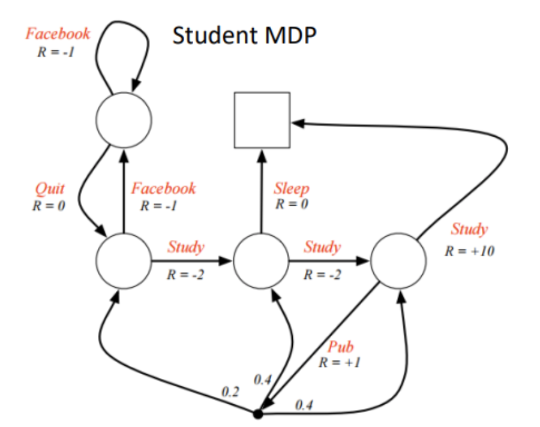
