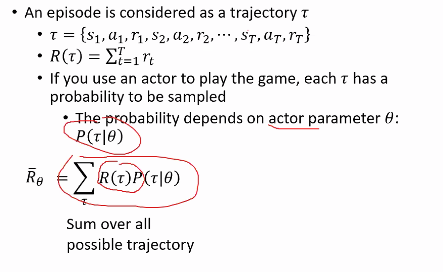
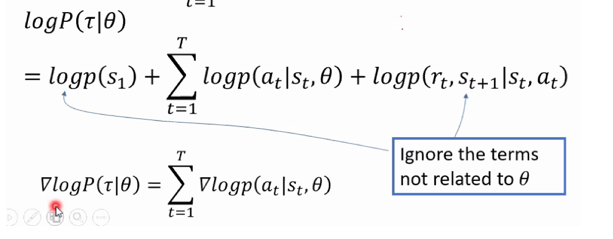
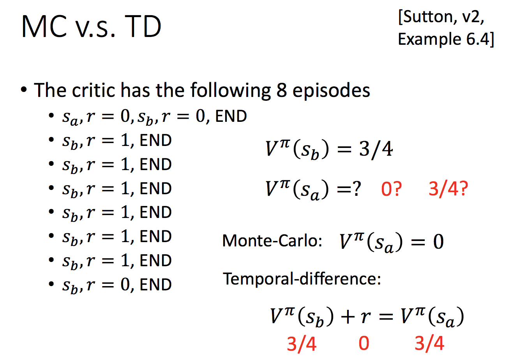

# Reinforcement Learning 2

> <https://www.bilibili.com/video/BV1UJ411F7Ri?p=1>

主要详细介绍强化学习的方法。上一部分，简单介绍过可以分成以下几种方法：

- Value-Based **（Learing an Critic）**

  包含Value Function，不包含Policy。

  Agent通过Value Function选择最优的措施。

- Policy-Based **（Learing an Actor）**

  包含Policy，不包含Value Function

- Actor-Critic **（Actor + Critic）**

  结合Policy与Value Function

- Model-Free

  包含Policy and/or Value Function

  不包含Model

- Model-Based

  包含Policy and/or Value Function

  包含Model

##Policy-based Approach (Learing an Actor)

> 目前理解：Agent根据State，做出Action的过程，即为Policy。
>
> 这个方法应该就是在讨论，如何通过State，得到Action。
>
> 这里的Actor应该指的就是Agent

如果用Depp Learing 作为 Agent 来解决这类问题。主要有三个步骤：

 

###第一步：使用Neural Network作为Actor，来做出Policy

此时，Policy $\pi$ 就是通过一个带有参数$\theta$的神经网络得到的。

输入：state or observation

输出：action

> 下图举例中，输入是图像，Actor是神经网络，输出是决策。
>
> 即根据当前场景，有神经网络得到下一步决策。

 

###第二步：定义损失函数（计算该Actor有多好）

#### 1. 参数定义：

- $\pi_{\theta}(s)$ 表示一个神经网络（Actor）

-  $\tau$ 表示结果轨迹 （Trajectory）

  $\tau = (s_1,a_1,r_1,…,s_T,a_T,r_T) $

  > state, action, reward...

- $R_\theta$ 表示总奖励

  $R_\theta = \sum_{t=1}^T r_t$

- $\overline R_\theta$ 表示奖励的期望值

> 下图为详细定义：

 

#### 2. $R_\theta$的随机性

$R_\theta$ 具有随机性，即使是同样的Actor，$R_\theta$可能也不一样。

#####原因：

因为Actor在针对同一个State，做出怎样的Action是有随机性的。Environment在针对同一个Action，做出怎样的State，也是有随机性的。

####3. 期望值$\overline R_{\theta}$的计算

由于$R_\theta$是一个随机变量，我们能计算的是它的期望值$\overline R_{\theta}$。

> 在给定$\theta $的情况下，我们能得到$R_\theta$的期望值。

#####（1）计算方法

穷举所有可能的 $\tau$ （Trajectory），每个 $\tau$ 都有对应概率。求取乘积之和。

$\overline R_{\theta} = \sum_\tau R(\tau) P(\tau|\theta )$

$R(\tau) = \sum_{t=1}^T r_t$

##### （2）计算 $P(\tau|\theta )$

> $\tau = (s_1,a_1,r_1,…,s_T,a_T,r_T) $
>
> 注意：$a$由Actor产生，$r$与$s$由Environment产生。

$p(s_1)$与$p(r_t,s_{t+1}|s_t,a_t)$与环境有关，与神经网络$\theta$或Agent无关。

#####（3）估计$\overline R_{\theta}$

$\overline R_{\theta} = \sum_\tau R(\tau) P(\tau|\theta )$

$R(\tau) = \sum_{t=1}^T r_t$

> 下图为详细介绍：

估计：

利用$\pi_\theta$玩$N$次。最终会获得$N$条结果，分别为$(\tau_1,\tau_2,…,\tau_N)$。此时$P(\tau|\theta)$可被估计成$\cfrac{1}{N}$。

> 下图为详细公式：

### 第三步：如何找到最好的actor，即$\theta$

####1. 梯度上升 Gradient Ascent

找到使$\overline R_{\theta}$最大的$\theta$，使用梯度上降：

> $\theta$是神经网络的一组参数。对$\overline R_\theta$求梯度，方法如下。

 

####2. Policy Gradient

> $\overline R_{\theta} = \sum_\tau R(\tau) P(\tau|\theta )$

#####（1）计算$\delta\overline R_{\theta}$

$\delta\overline R_{\theta}$的计算公式如下所示，有几项注意点：

1. 对$\overline R_{\theta}$求关于$\theta$的梯度，只跟$ P(\tau|\theta )$有关。

   所以，$\delta\overline R_{\theta} =\sum_\tau R(\tau) \delta P(\tau|\theta ) $

2. $\cfrac{\delta P(\tau|\theta )}{P(\tau|\theta)} = \delta logP(\tau | \theta)$，理由如黄色部分所示。

   所以，$\delta\overline R_{\theta} =\sum_\tau R(\tau)  P(\tau|\theta ) \delta logP(\tau | \theta)$

   > 黄色部分的意思即：
   >
   > $\delta f(x) = f(x)*\delta logf(x)$

 

#####（2）估计$\delta\overline R_{\theta}$

> 同估计$\overline R_{\theta}$原理一样。

利用$\pi_\theta$玩$N$次。最终会获得$N$条结果，分别为$(\tau_1,\tau_2,…,\tau_N)$。此时$P(\tau|\theta)$可被估计成$\cfrac{1}{N}$。

 

#####（3）$\delta logP(\tau | \theta)$的计算过程

- 计算步骤：

  - 计算$logP(\tau|\theta)$
  - 计算$\delta logP(\tau | \theta)$

- 第一步：计算$logP(\tau|\theta)$

  > $P(\tau|\theta)$，之前已经计算得到。下图计算得到$logP(\tau|\theta)$。

   

-  第二步：计算$\delta logP(\tau | \theta)$

  > 忽略与$\theta$无关的部分。下图计算得到$\delta logP(\tau|\theta)$。

   

#####（4）将$\delta logP(\tau | \theta)$代入$\delta \overline R_{\theta}$

> 这里的上标$n$，只是代表当前是第$n$条Trajectory。

#####（5）对上式的理解：【$\theta$朝着$\delta \overline R_{\theta}$为正的方向移动】

在某一次Sample的某一步骤中，要根据$s_t$执行$a_t$。如果发现该操作会导致最终Reward是正的，那需要增加在$s_t$执行$a_t$的机率。即$\theta$朝着$p(a_t^n|s_t^n)$变大的方向移动。

反之，如果该操作导致最终Reward是负的，那么需要减少在$s_t$执行$a_t$的机率。即$\theta$朝着$p(a_t^n|s_t^n)$变小的方向移动。

 

> 注意：计算总的奖励，比较有意义
>
> 为什么：因为Reward具有延迟性。所以计算总的比较有意义。例如，投资、围棋。

##### （6）实操举例

计算若干条$\tau$。通过计算$\delta\overline R_{\theta}$，不断调整参数。模型更新后，在重新计算若干条$\tau$。

 

> TODO: 跳过PDF 16，17，18的举例

##### （7）Tip： add a baseline

原因：有的游戏里分数都是正的或者都是负的。此时$\overline R$都是正的，即$\theta$朝着$p(a_t^n|s_t^n)$变大的方向移动。这样做不会有实质性问题。但是前面有不同大小的weight，即$R(\tau^n)$。这会导致weight大的上升小，weight小的上升大。如下图中第一行例子所示。由于$a,b,c$是机率，总和为零。所以做完Normalize之后，上升小的就相当于下降。这会导致某些Action，从来没有Sample到。如下图第二行解释，$a$理应也是要上升的，但它实质上没有被Sample到，导致它下降。

 

## Value-based Approach  (Learing an Ctitic)

### 一、Critic 定义

####理解

Critic不决定Action，而是评价一个Actor $\pi$有多好。

#### 举例

State Value Function $V^\pi(s)$

当使用Actor $\pi$时，$V^\pi(s)$在看到State or Observation $s$ 后，能计算获得**累积**奖励的期望值。

- 前提：Actor 为 $\pi$
- 输入：s
- 输出：scalar，表示在当前$s$基础上，估计得到的最终**累积**奖励的期望值。

 

###二、预测$V^\pi(s)$的方法

####1. 使用Monte-Carlo方法

 

该方法会计算：

- Actor看到状态$s_a$，它接下来的累积奖励$G_a$
- Actor看到状态$s_b$，它接下来的累积奖励$G_b$

由于，不可能把所有State都遍历（State这里可能是各种照片）。所以这个方法，其实是一个Network，估计出累积奖励$G$。

通过使得$V^\pi(s_a)$与$G_a$更接近，$V^\pi(s_b)$与$G_b$更接近，来训练$V^\pi(s)$。

> 缺点，必须将游戏玩到结束，才能估计$G$。

#### 2. 使用Temporal-difference 方法

 

输入：$s_t,a_t,r_t,s_{t+1}$

通过使得$V^\pi(s_{t})-V^\pi(s_{t+1})$与$r_t$更接近，来训练$V^\pi(s)$。

> 优点，不需要将游戏玩完。

#### 3. 比较MC与TD

#####（1）MC的variance很大

- MC

  因为$G_a$本身是一个随机变量。（同样的$s_a$，走到最后的$G_a$可能不一样，差别会很大）

  $Var[kX] = k^2Var[x]$，因此$G_a$的Variance很大

- TD

  这里的$r$也是一个随机变量。但会比$G_a$，$G_a$是很多$r$合起来，这里只是某一个$r$。

##### （2）TD的V不一定估计准确

 

##### （3）举例

Actor 为 $\pi$ 与环境互动八次得到的结果：

使用两种方法的结果不同。

MC考虑进$S_a$会影响$S_b$这件事，但也有可能这是一个巧合。

 

###三、另外一种Critic

输入：state和action的pair

理解：在一个state，强制采取某一个aciton。接下来假设都使用Actor $\pi$时，得到的累积期望值。

表达：有两种写法，见下。右边表达只适用于action可穷举时。

 

