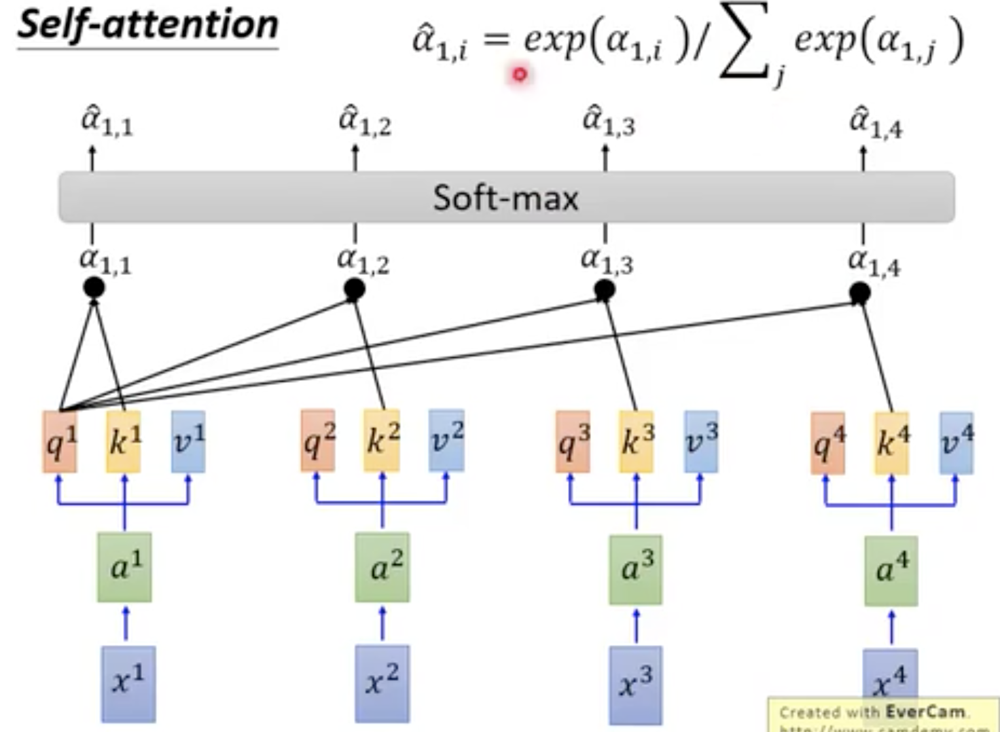

# Transformer Model

> 本质是对较长数据的表示（Representations of Variable Length Data）

## 比较

### Recurrent Neural Networks

- 顺序计算使并行化困难
- 没有对长距离和短距离依赖关系进行显式建模 （No explicit modeling of long and short range dependencies）

### Convolutional Neural Networks

- 易于并行化
- 要处理很长的序列，需要依赖很多层（如下图所示）

 

## Self - Attention

###1. 概述

有一种新的layer，叫做Self - Attention Layer。

与RNN一样，输入与输出，都是Sequence。且每个输出，都看过整个Sequence。

不同的是，Self - Attention 是同时计算的。即，下图中$b_1,b_2,b_3,b_4$是同时计算的。

 

###2. 计算$q,k,v$

Self - Attention Layer中，每个Input分别做三次Transformation，即分别乘上三个Matric，得到三个Vector。即$q,k,v$。

 

 

#### $q$

含义：代表Query，是要去Match其他人的。

计算：$a^1,a^2,a^3,a^4$均乘上$W^q$，得到$q^1,q^2,q^3,q^4$

####$k$

含义：拿来被Match的

#### $v$

含义：要被抽取出来的Infomation

### 3. 拿每一个Query $q$对每一个Key $k$ 做attention

#### 举例

拿$q^1$与每个$k$做Attention，得到四个结果。 

####Attention计算举例

Attention会吃两个向量，输出一个分数，表示这两个有多匹配。

Product Attention计算公式：

> $d$是$q$与$k$的dim（两个dim是一样的）
>
> 为什么要除以$d$：因为，前面部分的数值会随着q和d维度的增大而增大。

### 4. 处理attention 结果，得到$\hat \alpha_{1,i}$

做Softmax后，进行normalization，得到$\hat \alpha_{1,i}$

同理，其他$q$也会得到$\hat \alpha_{2,i},\hat \alpha_{3,i},\hat \alpha_{4,i}$

 

###5. 每个$\hat \alpha_{1,i}$与对应$v_i$相乘后相加，最终得到$b^1$ 

同理，能得到$b^2,b^3,b^4$

> 每个$b$，都是由整条Seuqence得到的。
>
> 每个$b$的计算，都是平行计算的。

 

### 6. 总结

输入：一个Sequence  $a^1,a^2,a^3,a^4$

输出：一个Sequence  $b^1,b^2,b^3,b^4$

### 7. 矩阵运算实现平行化

#### （1）transformation的矩阵化

 

#### （2）attention的矩阵化

>  $\alpha_{1,1}$和$\alpha_{1,2}$的计算也可以是平行的

 

 

####（3）计算$b$

 

#### （4）总结

> 矩阵乘法，可以用GPU加速。

 

### 8. Self - Attention的缺陷

为考虑顺序，A打B和B打A对它而言是一样的。

这个问题，在**Positional Encoding**中解决。

## Multi-head Self-Attention

差别：生成了多个$q,k,v$

举例：有两个head。

计算：$q,k,v$之间的运算，都只跟对应序号的发生。如第一类只跟第一类发生计算。

 

 

将$b^{i,1},b^{i,2}$做Transformation后，降维得到$b^i$。

 

### Multi-head 的好处

不同head看不同的资讯。有的head看local的资讯，有的head看长时的资讯。

multi-head可以各司其职。

 

> **TODO: 后面还没有好好复习**

## Positional Encoding

在每一个$a^i$前，加一个位置的资讯$e^i$

 

## Attention 在 Seq2Seq 中如何使用

> 总之，看到RNN，都可以用Self Attention 取代掉。

 

注意：

Decoder中第二层的输入是：$o^1$和$c^2$

## Transformer

 

左半部分是Encoder，右半部分是Decoder。

###举例：中文翻译成英文。

Encoder 输入：机器学习

Decoder

- 输出 Machine
- 输入 Machine后，输出Learnig

#### Encoder 详细

- 加一个Positional Encoding，进入灰色block（重复N次）

- 进入 Multi-Head Attention

    

- Add & Norm

  将上一层的输入与输出相加

   

- Feed Forward + Add & Norm

#### Decoder 详细

- 加一个Positional Encoding，进入灰色block（重复N次）

- Masked Multi-head Attention

  只会跟已经产生到的Sequence 做Attention 

  ...

  ​

  ​